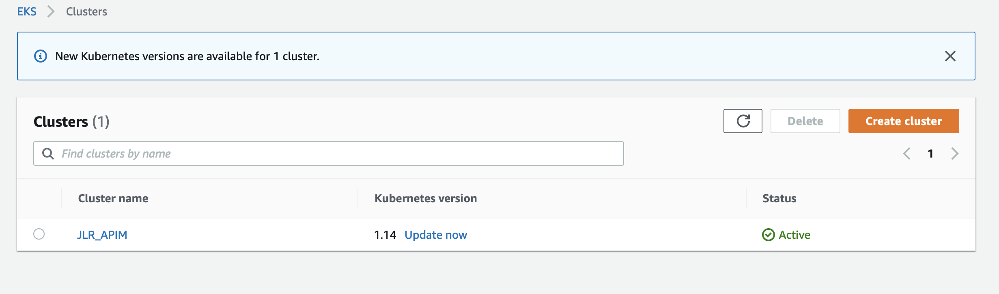
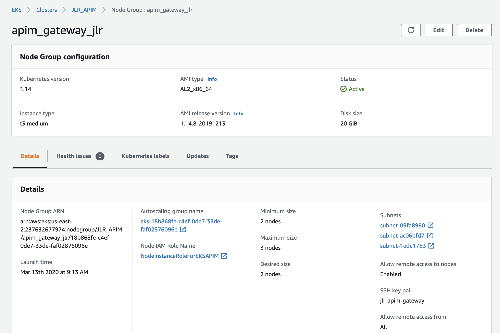
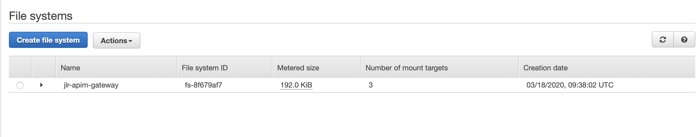

# API Manager 3.0 AWS EKS EFS ECR K8s AutoScale Deployment
Deploying API Manager 3.0 in a k8s cluster in AWS EKS with hpa and sharing synapse configs with AWS EFS(NFS) volume mount.

## Setup EKS CLuster
You can follow the following full guide to setup a AWS EKS Cluster.

[Getting Started with Amazon EKS](https://docs.aws.amazon.com/eks/latest/userguide/getting-started-console.html)

We are providing following major steps for your reference.

### 1. Install AWS CLI

To install or upgrade the AWS CLI, follow [Install AWS CLI](https://docs.aws.amazon.com/cli/latest/userguide/cli-chap-install.html)

You can check your AWS CLI version with the following command:

```sh
>> aws --version
```

### 2. Configure Kubectl with the EKS cluster

Use the AWS CLI command: [update-kubeconfig](https://docs.aws.amazon.com/cli/latest/reference/eks/update-kubeconfig.html) to configure the `kubectl` so that you can connect to an Amazon EKS cluster. 

```sh
>> aws eks --region region update-kubeconfig --name cluster_name
```

For the following case it is `JLR_APIM` and configure `kubectl` as follows.



```sh
>> aws eks --region us-east-2 update-kubeconfig --name JLR_APIM
```

Test your configuration.
```sh
>> kubectl get svc
```

Output:
```sh
NAME         TYPE        CLUSTER-IP   EXTERNAL-IP   PORT(S)   AGE
kubernetes   ClusterIP   10.100.0.1   <none>        443/TCP   1m
```

Verify that you have running Node Groups with following command. Otherwise launch a [Managed Node Group](https://docs.aws.amazon.com/eks/latest/userguide/managed-node-groups.html).
```sh
>> kubectl get nodes
```

Output:
```sh
NAME                                          STATUS   ROLES    AGE   VERSION
ip-172-31-24-135.us-east-2.compute.internal   Ready    <none>   6d    v1.14.8-eks-b8860f
ip-172-31-3-184.us-east-2.compute.internal    Ready    <none>   6d    v1.14.8-eks-b8860f
```

Here, when setting up the EKS Cluster earlier following node group configurations were used.

- Minimum size: 2 nodes
- Maximum size: 3 nodes
- Desired size: 2 nodes

Therefore, by normal at least two nodes are active at all time.



### 3. Create an Amazon EFS storage for NFS.

You can use Amazon EFS to mount the synapse configs. Following doc [Create EFS storage](https://docs.aws.amazon.com/efs/latest/ug/getting-started.html)



## Deploy API Manager 3.0.0 optimized as a gateway-worker in EKS

- Configure the .yaml files in the /configured directory accordingly.
- Execute the following command to setup the gateway deployement.
```sh
>> kubectl apply -f configured/
```
Output:
```sh
horizontalpodautoscaler.autoscaling/wso2apim created
storageclass.storage.k8s.io/aws-efs created
configmap/efs-provisioner created
namespace/wso2 created
configmap/apim-conf created
deployment.apps/wso2apim created
persistentvolumeclaim/gateway-shared-synapse-configs-volume-claim created
persistentvolume/gateway-shared-synapse-configs-volume created
service/wso2apim created
```

You can see a sample deployment information in the following image.


Here, you can see the following autoscaling policy applied
```sh
NAME               REFERENCE                 TARGETS         MINPODS   MAXPODS   REPLICAS   AGE
petstore-api-hpa   Deployment/petstore-api   <unknown>/50%   1         5         1          5d19h
wso2apim           Deployment/wso2apim       <unknown>/50%   1         10        1          6d
```
Therefore, if the CPU Utilization of a pod exceeds 50% deployment will scale the pods up to maximum of 10 pods.

Please note the "wso2apim" is the deployment of the normal WSO2 API Manager Gateway. The deployment named in the image "petstore-api" is a WSO2 API Microgateway deployment using WSO2 APIM K8s operator. 
You can deploy the MG deployment in AWS EKS by following this guide [Microgateway Deployment in AWS EKS](https://github.com/wso2/K8s-api-operator/blob/master/docs/HowToGuide/working-with-aws.md).

## Try out

Execute following command to view the server logs.

```sh
>> kubectl logs <POD_ID> -n wso2
```

- You can access the gateway using the external ip provided by the LB.

- [x] US Backend

```sh
>> curl -X GET "http://a9638b7556d9711eaa663064b99b1f5c-1286476463.us-east-2.elb.amazonaws.com:8080/entities/vehicles/25" -H "accept: application/json" -k
```

- [x] Generate a token from Central-EU-All-in-One node for VehicleInfo-US API (https://35.228.218.176:9443/devportal/apis/)

```sh
>> TOKEN=eyJ0eXAiOiJKV1QiLCJhbGciOiJSUzI1NiIsIng1dCI6Ik9UZ3pPRE0wTlRVMU1EQTVPVFppWTJFM1ptUmlOVFpsWkRVek9UUTNZMk0yWW1VeFlqVmtOQT09In0.eyJhdWQiOiJodHRwOlwvXC9vcmcud3NvMi5hcGltZ3RcL2dhdGV3YXkiLCJzdWIiOiJhZG1pbkBjYXJib24uc3VwZXIiLCJhcHBsaWNhdGlvbiI6eyJvd25lciI6ImFkbWluIiwidGllciI6IlVubGltaXRlZCIsIm5hbWUiOiJUZXN0SldUIiwiaWQiOjUsInV1aWQiOm51bGx9LCJzY29wZSI6ImFtX2FwcGxpY2F0aW9uX3Njb3BlIGRlZmF1bHQiLCJpc3MiOiJodHRwczpcL1wvMzUuMjI4LjIxOC4xNzY6OTQ0M1wvb2F1dGgyXC90b2tlbiIsInRpZXJJbmZvIjp7IlVubGltaXRlZCI6eyJzdG9wT25RdW90YVJlYWNoIjp0cnVlLCJzcGlrZUFycmVzdExpbWl0IjowLCJzcGlrZUFycmVzdFVuaXQiOm51bGx9fSwia2V5dHlwZSI6IlBST0RVQ1RJT04iLCJzdWJzY3JpYmVkQVBJcyI6W3sic3Vic2NyaWJlclRlbmFudERvbWFpbiI6ImNhcmJvbi5zdXBlciIsIm5hbWUiOiJQZXRzdG9yZS1BUEkiLCJjb250ZXh0IjoiXC9wZXRzdG9yZVwvdjFcL3YxIiwicHVibGlzaGVyIjoiYWRtaW4iLCJ2ZXJzaW9uIjoidjEiLCJzdWJzY3JpcHRpb25UaWVyIjoiVW5saW1pdGVkIn0seyJzdWJzY3JpYmVyVGVuYW50RG9tYWluIjoiY2FyYm9uLnN1cGVyIiwibmFtZSI6IlBldHN0b3JlLUp3dCIsImNvbnRleHQiOiJcL3BldHN0b3Jland0XC92MSIsInB1Ymxpc2hlciI6ImFkbWluIiwidmVyc2lvbiI6InYxIiwic3Vic2NyaXB0aW9uVGllciI6IlVubGltaXRlZCJ9LHsic3Vic2NyaWJlclRlbmFudERvbWFpbiI6ImNhcmJvbi5zdXBlciIsIm5hbWUiOiJWZWhpY2xlSW5mby1VUyIsImNvbnRleHQiOiJcL3ZlaGljbGUtaW5mb1wvdXNcLzEiLCJwdWJsaXNoZXIiOiJhZG1pbiIsInZlcnNpb24iOiIxIiwic3Vic2NyaXB0aW9uVGllciI6IlVubGltaXRlZCJ9XSwiY29uc3VtZXJLZXkiOiJINldibkFlQUg2WE1nR3VmSFNLejI0X016V2thIiwiZXhwIjoxNTg1MDU2NzUxLCJpYXQiOjE1ODUwNTMxNTEsImp0aSI6IjlhMmZjMzQ0LWUyZDQtNDcwMC1iZWEyLWI2YmNkNGU3ZjE4NCJ9.HXs-d8a6b-hVO3-AmI3UExF2jiPWOB9Sx_KDelQsVNm6Gzn2RAhBwqtSERvpsj-VjZXbf5BKRKn2cV7BP9oc_IwVKKtgjJCKn8UN5EyM30KZ_HKkip6s_mCHWTJeYGKeRcLx_U3qtwU7NKWD80ZsBKkaemCjSElVwwo5WhunLhtndOhTKz_L4FwNi5wikOm30Ssp0VwvBJpVHD_RdZcSfsYvM2BPnlg6HGH6MH5BGT42bTw8QKJk5LIVJW77B3QxQevNZCEq22SJdnk2oqz-YhdrzfBH8zv6Qrv31OB8iI6-Ftc6EJ8yr6j0ZUHZPXRarXhVc6am8nvxFxoZ6KDtRQIgBZxg2qK66LN3Caj5dXfxumcoMyhd0qVUKqolas2kTTOhP48ukFaBO35YRvwsfWszmQTPE3fGOSd1ZZxCjioczo89LcGajNmknZkQ_qrjRPLCs85WSj1RaQ3SOHMjliaZ9-dfdPy2YGIIwcAbqQ6a27DpLE_0ybtbXlJIbVZtTR-bPVt3AOR-BAkNXkncqMUAr2h-cA5qxiODNIYzBhNEfRlXJS5bTlHIaiStfEEk6AVWSOVJoA4rjSAcw91nIrrwEsiLpK2FWhqgzHaHa6iY9Y_-JpPeFuRXhfzpmjP17fc96R4j4LbwXNrIOvoJQKUl_NoeKooT_MjSDyh0wl0
```

- [x] US Synapse Gateway

```sh
>> curl -X GET "https://ad998945664e011eabf900aa2059d57f-933146450.us-east-2.elb.amazonaws.com:30801/vehicle-info/us/1/entities/vehicles/25" -H  "accept: */*" -H  "Authorization: Bearer $TOKEN" -k
```

- [x] US Microgateway

```sh
>> curl -X GET "https://a8b5e32246dc111eaa663064b99b1f5c-1976786525.us-east-2.elb.amazonaws.com:9095/vehicle-info/us/1/entities/vehicles/25" -H "accept: application/json" -H "Authorization:Bearer $TOKEN" -k
```

- You can access the Microgateway/Synapse Gateway using the external ips provided by the LB.

Output:

```sh
{"id":"25", "reg_driver":"Allen Wallace", "model":"Defender", "year":2015, "city":"New York"}
```

## Clean up

If you need to remove only the deployment from the AWS EKS cluster execute the following command.
```sh
>> kubectl delete -f configured/
```
Or else,

- Delete the AWS ECR repository.
- Delete the AWS EKS cluster.
- Delete the AWS EFS storage.
