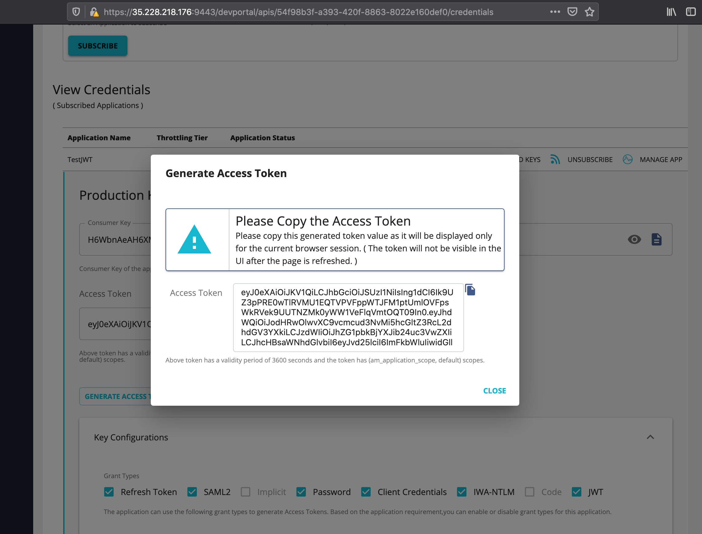

# Run Load Testing Scenarios
After successfully deploying WSO2 API Manager 3.0 Standard Synapse Gateway and Microgateway in a k8s cluster,
you can run a load test to verify the Horizontal Pod AutoScaling(HPA).
 
Here, we are going to use the JMeter to run the load tests.

You can find the video of the following demo in this link : [Load Test Demo](https://drive.google.com/file/d/1IZoPkZcca-1aVe6jz1U-7HwqK8tWmYlJ/view) 
 
## Setup JMeter

1 . Run the JMeter. Here, you can use the JMeter provided in the <REPO_HOME>/load-testing-artifacts/ directory.

```sh
>> java -jar ApacheJMeter.jar
```

2 . Load the scripts provided in the <REPO_HOME>/load-testing-artifacts/scripts directory.

- use VehicleMG.jmx for testing MicroGateway AutoScaling.
- use VehicleSG.jmx for testing Standard Gateway AutoScaling.

3 . Generate an Access Token to invoke the API.

Generate a token from Central-EU-All-in-One node for VehicleInfo-US API (https://35.228.218.176:9443/devportal/apis/)



4 . Replace the Authorization header in the request with the newly generated access token.
 
 
 
 ## Testing
 
 ### MicroGateway AutoScaling Testing
 
 1 . Verifying what are the pods running normally.
 
 ```sh
 >> kubectl get pods
 ```

Output:

```sh
NAME                              READY   STATUS    RESTARTS   AGE
petstore-jwt-57d8c4ff7-wp4bv      1/1     Running   0          26h
vehicle-info-mg-cf9f97b95-dltxv   1/1     Running   0          16h
vehicleinfo-996b7cf5-78x96        1/1     Running   0          21h
```

note: 
- vehicle-info-mg-cf9f97b95-dltxv is the VehicleInfo API deployed as a Microgateway(which will be used in the demo)
- vehicleinfo-996b7cf5-78x96 is the backend of the VehicleInfo API.
- petstore-jwt-57d8c4ff7-wp4bv is the default api deployed as a Microgateway to verify the scenario.

2 . Checking what the hpa policies applied.  

 ```sh
 >> kubectl get hpa
 ```

Output:

```sh
NAME                  REFERENCE                    TARGETS   MINPODS   MAXPODS   REPLICAS   AGE
petstore-jwt-hpa      Deployment/petstore-jwt      1%/50%    1         5         1          26h
vehicle-info-mg-hpa   Deployment/vehicle-info-mg   13%/50%   1         5         1          17h
```

2 . Checking the current metrics of the relevant pod without load.  

 ```sh
 >> kubectl top pods vehicle-info-mg-cf9f97b95-dltxv
 ```

Output:

```sh
NAME                              CPU(cores)   MEMORY(bytes)
vehicle-info-mg-cf9f97b95-dltxv   7m           233Mi
```

Note: CPU utilization is very low.

3 . Start the loaded script using the JMeter.

4 . Checking the current metrics of the relevant pod after load.

 ```sh
 >> kubectl top pods vehicle-info-mg-cf9f97b95-dltxv
 ```

Output:

```sh
NAME                              CPU(cores)   MEMORY(bytes)
vehicle-info-mg-cf9f97b95-dltxv   288m         269Mi
```

Note: CPU Utilization has exceeded the 50% of Pods dedicated CPU(500m). Therefore, a new pod should be spinning up right now to cater the load.

5 . Stop the running script using the JMeter.

6 . Check what are the pods running(with load).
 
```sh
 >> kubectl get pods
```

Output:

```sh
NAME                              READY   STATUS    RESTARTS   AGE
petstore-jwt-57d8c4ff7-wp4bv      1/1     Running   0          26h
vehicle-info-mg-cf9f97b95-dltxv   1/1     Running   0          17h
vehicle-info-mg-cf9f97b95-wrtsk   1/1     Running   0          19s
vehicleinfo-996b7cf5-78x96        1/1     Running   0          21h
```

Note: A new pod vehicle-info-mg-cf9f97b95-wrtsk has spin up automatically due to the load.


7 . Re-Checking the hpa configuration.  

 ```sh
 >> kubectl get hpa
 ```

Output:

```sh
NAME                  REFERENCE                    TARGETS   MINPODS   MAXPODS   REPLICAS   AGE
petstore-jwt-hpa      Deployment/petstore-jwt      1%/50%    1         5         1          26h
vehicle-info-mg-hpa   Deployment/vehicle-info-mg   19%/50%   1         5         2          17h
```

Note: You can see now 2 replicas of Vehicle-info-mg microgateways are deployed. Therefore, we have successfully scaled the pods with the load.

8 .  Re-Checking pods to verify pods gets scaled down after the load.

```sh
 >> kubectl get pods
```

Output:

```sh
NAME                              READY   STATUS        RESTARTS   AGE
petstore-jwt-57d8c4ff7-wp4bv      1/1     Running       0          26h
vehicle-info-mg-cf9f97b95-dltxv   1/1     Running       0          17h
vehicle-info-mg-cf9f97b95-wrtsk   1/1     Terminating   0          6m16s
vehicleinfo-996b7cf5-78x96        1/1     Running       0          21h
```

Note: You can see one the replicas getting terminated automatically after the scaled down load.
Usually takes about 5 minutes of less load to scale down the pods.


9 . Finally verify the pods running with less load.

```sh
 >> kubectl get pods
```

Output:

```sh
NAME                              READY   STATUS    RESTARTS   AGE
petstore-jwt-57d8c4ff7-wp4bv      1/1     Running   0          26h
vehicle-info-mg-cf9f97b95-dltxv   1/1     Running   0          17h
vehicleinfo-996b7cf5-78x96        1/1     Running   0          21h
```

Note: Scaled up pod has been terminated and scaled down the deployment successfully after a slack time of 5 minutes.

### Standard Gateway AutoScaling Testing
 
 1 . Verifying what are the pods running normally.
 
 ```sh
 >> kubectl get pods -n wso2
 ```

Output:

```sh
NAME                       READY   STATUS    RESTARTS   AGE
wso2apim-b7474999b-wkl5n   1/1     Running   0          18h
```

note: 
- wso2apim-b7474999b-wkl5n is the VehicleInfo API deployed in the Standard Gateway(which will be used in the demo)

2 . Checking what the hpa policies applied.  

 ```sh
 >> kubectl get hpa -n wso2
 ```

Output:

```sh
NAME       REFERENCE             TARGETS   MINPODS   MAXPODS   REPLICAS   AGE
wso2apim   Deployment/wso2apim   4%/85%    1         5         1          4d2h
```

2 . Checking the current metrics of the relevant pod without load.  

 ```sh
 >> kubectl top pods wso2apim-b7474999b-wkl5n -n wso2
 ```

Output:

```sh
NAME                       CPU(cores)   MEMORY(bytes)
wso2apim-b7474999b-wkl5n   19m          941Mi
```

Note: CPU utilization is very low.

3 . Start the loaded script using the JMeter.

4 . Checking the current metrics of the relevant pod after load.

 ```sh
 >> kubectl top pods wso2apim-b7474999b-wkl5n -n wso2
 ```

Output:

```sh
NAME                       CPU(cores)   MEMORY(bytes)
wso2apim-b7474999b-wkl5n   510m         948Mi
```

Note: CPU Utilization has exceeded the 50% of Pods dedicated CPU(800m). Therefore, a new pod should be spinning up right now to cater the load.

5 . Stop the running script using the JMeter.

6 . Check what are the pods running(with load).
 
```sh
 >> kubectl get pods -n wso2
```

Output:

```sh
NAME                       READY   STATUS    RESTARTS   AGE
wso2apim-b7474999b-jkr75   0/1     Running   0          30s
wso2apim-b7474999b-wkl5n   1/1     Running   0          18h
```

Note: 
- A new pod wso2apim-b7474999b-jkr75 has spin up automatically due to the load.
- ReadinessProbe checks readiness after 5 minutes therefore, it' still shows as not ready although it's in running state.


7 . Re-Checking the hpa configuration.  

 ```sh
 >> kubectl get hpa -n wso2
 ```

Output:

```sh
NAME       REFERENCE             TARGETS   MINPODS   MAXPODS   REPLICAS   AGE
wso2apim   Deployment/wso2apim   12%/85%    1         5         2          4d2h
```

Note: You can see now 2 replicas of wso2apim are deployed. Therefore, we have successfully scaled the pods with the load.

8 .  Re-Checking pods to verify pods to verify they are in ready state after 5 minutes.

```sh
 >> kubectl get pods -n wso2
```

Output:

```sh
NAME                       READY   STATUS    RESTARTS   AGE
wso2apim-b7474999b-jkr75   1/1     Running   0          5m11s
wso2apim-b7474999b-wkl5n   1/1     Running   0          18h
```

8 .  Re-Checking pods to verify pods gets scaled down after the load.

```sh
 >> kubectl get pods -n wso2
```

Output:

```sh
NAME                       READY   STATUS        RESTARTS   AGE
wso2apim-b7474999b-jkr75   1/1     Terminating   0          6m6s
wso2apim-b7474999b-wkl5n   1/1     Running       0          18h
```

Note: You can see one the replicas getting terminated automatically after the scaled down load.
Usually takes about 5 minutes of less load to scale down the pods.


9 . Finally verify the pods running with less load.

```sh
 >> kubectl get pods -n wso2
```

Output:

```sh
NAME                       READY   STATUS    RESTARTS   AGE
wso2apim-b7474999b-wkl5n   1/1     Running   0          18h
```

Note: Scaled up pod has been terminated and scaled down the deployment successfully after a slack time of 5 minutes.


